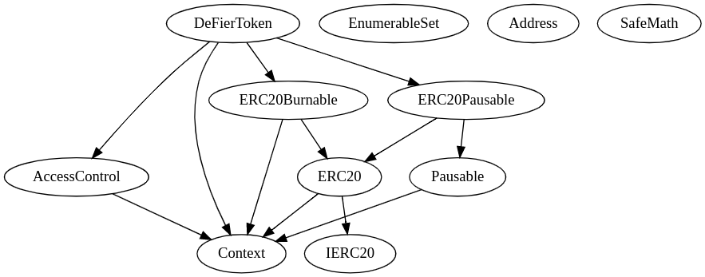
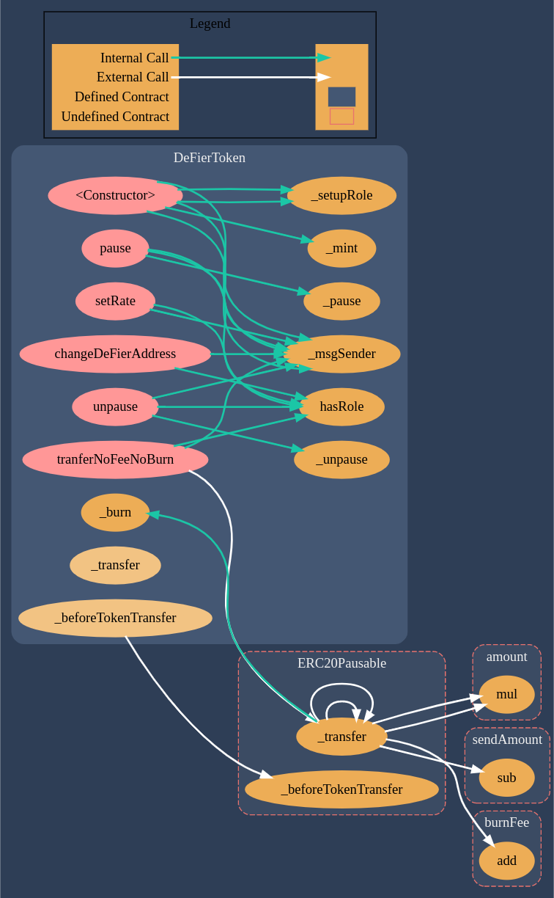

# DeFier Token (DFR)

## Smart Contracts for the [DeFier](https://www.DeFier.io/) Token

#### Please make sure the .env file is up to date before starting.

### Concerning the contracts:

- We use [openZepplin SDK](https://openzeppelin.com/sdk/) compiling, deploying, and interacting with reusable and secure Smart Contracts

### InheritanceTree

### DeFierToken Functions Flow

## Built With

- [Node.js](https://nodejs.org/en/) - JavaScript runtime
- [NPM.js](https://www.npmjs.com/) - package manager for Node.js packages
- [Chai](https://chaijs.com/) - javascript testing framework
- [Ethereum](https://www.ethereum.org/) - Decentralized platform for Smart Contract applications
- [OpenZepplin](https://github.com/OpenZeppelin/zeppelin-solidity) - Reusable and Secure Smart Contracts
- [Truffle](https://github.com/trufflesuite/truffle) - Development environment, testing framework and asset pipeline for Ethereum
- [ganache](https://github.com/trufflesuite/ganache-cli) - Node.js based Ethereum client for testing and development
- [Infura](https://infura.io/) - Ethereum API and IPFS API for building Ethereum blockchain applications on a scalable cloud infrastructure with reliable transaction processing.

## Authors

- [DeFier](https://www.DeFier.io/) BlockChain Team

## License

Code released under the [MIT License](LICENSE.md).